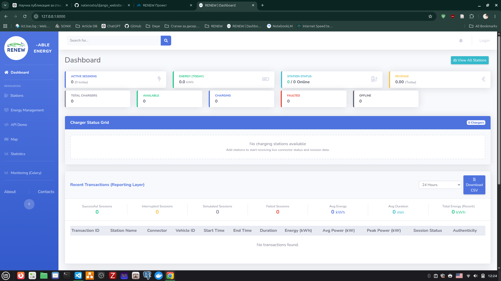
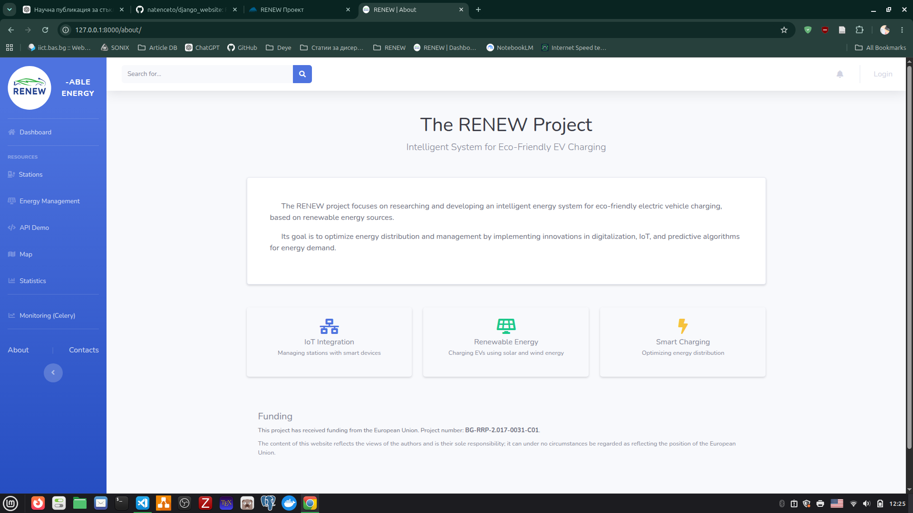
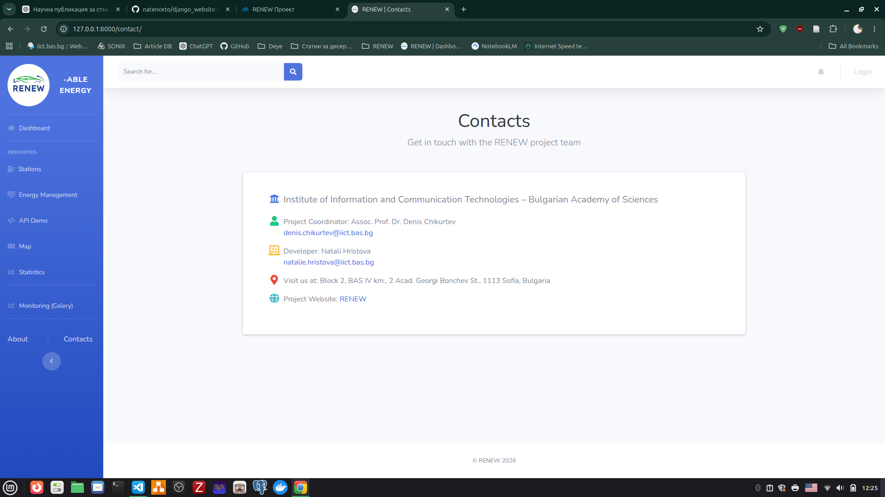
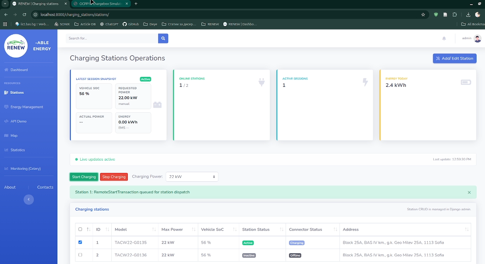
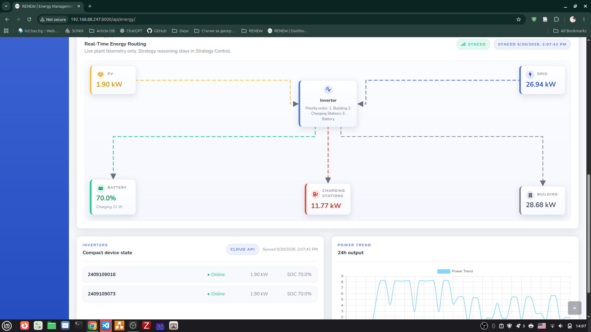

# RENEW

[](LICENSE) 
[Project site](https://www.iict.bas.bg/projects/2025/RENEW/index.html)

**Funded by:** European Union — Project number: **BG-RRP-2.017-0031-C01**

RENEW is a Django-based EV charging platform with OCPP 1.6J communication, PostgreSQL persistence, Redis-backed realtime delivery, Celery background tasks, charging analytics, and Deye energy integrations.

## Screenshots

Preview screenshots of the application (click to view full size):







The project title is: Research and development of a smart energy system for eco-charging of electric vehicles, using renewable energy sources.

## Access Policy

The project is intentionally restricted to these access hosts only:

- `localhost`
- `127.0.0.1`
- `192.168.88.247`

Do not add other public hosts unless you intentionally broaden the deployment model. For public or institutional deployments, configure `ALLOWED_HOSTS`, `CSRF_TRUSTED_ORIGINS` and `CORS_ALLOWED_ORIGINS` via environment variables, and avoid committing network-specific IPs to the repository.

## Stack and Versions

### Protocol and Runtime

- OCPP profile: OCPP 1.6J (JSON over WebSocket; subprotocol `OCPP1.6`/`ocpp1.6`)
- Python: `3.12` (container base image)
- Django: `5.2`
- Docker Compose: V2

### Infrastructure Containers

- PostgreSQL: `15-alpine`
- Redis: `7-alpine`
- Nginx (production compose): `1.25-alpine`

### Production Python Dependencies

- Django: `5.2`
- psycopg: `3.2.10`
- python-dotenv: `1.1.1`
- channels: `4.3.1`
- channels-redis: `4.2.1`
- daphne: `>=4.1.0`
- uvicorn: `0.37.0`
- gunicorn: `>=21.2.0`
- websockets: `13.1`
- ocpp: `0.17.0`
- whitenoise: `6.11.0`
- django-environ: `0.12.0`
- jsonschema: `4.4.0`
- redis (Python client): `5.2.1`
- djangorestframework: `3.15.2`
- django-filter: `24.3`
- drf-spectacular: `0.28.0`
- djangorestframework-simplejwt: `5.4.0`
- django-cors-headers: `4.6.0`
- requests: `>=2.31.0`
- user-agents: `>=2.2.0`
- deye-controller: `0.2.3`
- pyserial: `3.5`
- pysolarmanv5: `3.0.6`
- umodbus: `1.0.4`
- celery: `>=5.3.6`
- django-celery-beat: `>=2.5.0`
- django-celery-results: `>=2.5.0`
- flower: `2.0.1`
- hiredis: `>=2.3.2`
- pymodbus: `3.12.1`

### Development Dependencies (additional)

- mypy: `1.17.0`
- black: `24.10.0`
- isort: `5.13.2`
- flake8: `7.1.1`
- django-debug-toolbar: `4.4.6`
- ipython: `8.29.0`

### Testing Dependencies

- pytest: `8.3.4`
- pytest-django: `4.9.0`
- pytest-asyncio: `0.24.0`
- pytest-cov: `6.0.0`
- factory-boy: `3.3.1`
- faker: `33.1.0`
- coverage: `7.6.9`

### Frontend Vendor Libraries

- jQuery: `3.6.0`
- Bootstrap (JS bundle): `4.6.0`
- Chart.js: `2.9.4`
- Font Awesome Free: `5.15.3`
- jQuery Easing: `1.4.1`

## First Start

Always start with `setup.sh` after cloning the project.

```bash
git clone <repository-url>
cd django_website
./setup.sh
```

`setup.sh` is the canonical bootstrap entrypoint. It does the initial preparation in the correct order:

1. Creates `.env` from `.env.example` if it is missing.
2. Creates `.venv` if it is missing.
3. Installs `requirements/dev.txt` into `.venv`.
4. Verifies Docker and Docker Compose availability.
5. Starts the local stack with `docker compose up --build -d` when Docker is available.
6. Runs `python manage.py migrate`.
7. Runs `python manage.py check`.
8. Prompts to create a superuser only when no superuser exists yet.

If you want the virtual environment active in your current shell after the script finishes:

```bash
source .venv/bin/activate
```


## Environment Configuration

The project reads configuration from `.env`. Do NOT commit secrets (API keys, passwords, or private tokens) into the repository. Use the provided `.env.example` as a starting point and create a local `.env` file with production secrets kept out of version control.

Important notes:

- `POSTGRES_PASSWORD` must be set explicitly for production.
- Redis is the expected backend for Channels, Celery, and cache in containerized runs.
- `REDIS_URL` is mandatory when `DEBUG=False`.
- API docs are enabled only when `ENABLE_API_DOCS=True`.
- `SECURE_SSL_REDIRECT` should remain `False` until TLS is terminated at a proxy.
- For browser/frontend integrations, include both HTTP and HTTPS origins where needed.
- In production-style setups, include HTTPS hosts in both `CSRF_TRUSTED_ORIGINS` and `CORS_ALLOWED_ORIGINS`.
- `DEYE_*` variables are required for DeyeCloud integrations (keep credentials secret).

## API Documentation Endpoints

When `ENABLE_API_DOCS=True`, these routes are available:

- `/api/schema/`
- `/api/docs/`
- `/api/redoc/`

## Local Docker Workflow

Use this for day-to-day development after `setup.sh` has prepared the environment:

```bash
docker compose up -d --build
docker compose logs -f web
docker compose down
```

The development stack behavior is:

- Django app on `http://localhost:8000` (may also be reachable on a local network address if you configure `ALLOWED_HOSTS` accordingly)
- PostgreSQL and Redis are typically published on localhost for local development; bind addresses and ports are configurable via the Compose file or environment variables.

## Production-Style Docker Workflow

Use the production compose file when you want Gunicorn + Nginx + restart policies:

```bash
docker compose -f docker-compose.prod.yml up -d --build
docker compose -f docker-compose.prod.yml logs -f web
docker compose -f docker-compose.prod.yml down
```

Current production-style behavior:

- Gunicorn runs the ASGI app with Uvicorn workers.
- Nginx listens on the configured production addresses (see `docker-compose.prod.yml` and your reverse proxy configuration).
- Nginx rejects host headers outside the allowed host set.
- WebSocket traffic may be rate-limited in the reverse proxy.
- API docs are disabled by default.

TLS note:

- The project is prepared for secure-cookie and proxy-aware HTTPS behavior when `DEBUG=False`.
- If you add real TLS termination, set `SECURE_SSL_REDIRECT=True` and configure certificates at the reverse proxy layer.
- Do not force HTTPS redirects before the proxy actually serves HTTPS, or you will create redirect loops or a broken deployment.

## Superuser Creation

Interactive superuser creation during `setup.sh` is the default practice for this repository.

Why:

- It avoids hardcoded credentials.
- It avoids creating admin accounts during container boot.
- It always prompts during setup so you can choose `y` or `n` each run.

If you need a non-interactive bootstrap for automation, use environment variables and run:

```bash
DJANGO_SUPERUSER_CREATE=1 \
DJANGO_SUPERUSER_USERNAME=admin \
DJANGO_SUPERUSER_EMAIL=admin@example.com \
DJANGO_SUPERUSER_PASSWORD=change-me \
python setup_superuser.py
```

The entrypoint does not auto-create superusers.

## Manual Local Workflow Without Docker

If Docker is unavailable, `./setup.sh local` prepares `.venv` and prints the local next steps.

Typical manual sequence:

```bash
./setup.sh local
source .venv/bin/activate
# Option A: run against local Postgres/Redis (update .env accordingly)
python manage.py migrate
python manage.py createsuperuser
python manage.py check
uvicorn renew_website.asgi:application --host 0.0.0.0 --port 8000

# Option B: quick local run for screenshots without Postgres/Redis
# (uses `renew_website.settings_local`, sqlite + in-memory channels)
python manage.py migrate --settings=renew_website.settings_local
python manage.py createsuperuser --settings=renew_website.settings_local
python manage.py runserver 0.0.0.0:8000 --settings=renew_website.settings_local
```

For manual local runs you still need PostgreSQL and Redis running separately.

## Runtime Components

- Django serves HTTP and API traffic.
- Channels serves OCPP and browser WebSocket traffic.
- Redis backs Channels, Celery, and Django cache when configured.
- Celery worker executes background tasks.
- Celery Beat schedules periodic tasks.
- Nginx is used in the production-style stack.
- On ASGI startup, station and connector statuses are reset to avoid stale online/active state from previous runs.

## OCPP Endpoints

Charging station connections:

- `ws://localhost:8000/ws/charging_stations/{station_id}/`

For deployments on a local network or public host, replace `localhost` with the appropriate hostname or origin configured in your environment variables; do not embed institution-specific IPs in the repository documentation.

Browser status socket:

- `/ws/stations/status/`
- `/ws/station/{station_id}/`

The browser status socket now requires an authenticated Django user session.

## Schema Change Workflow

Whenever models change, use this order:

```bash
docker compose exec -T web python manage.py makemigrations
docker compose exec -T web python manage.py migrate
docker compose exec -T web python manage.py check
```

Do not skip `migrate` after creating migrations. This project has realtime and worker processes that assume the schema is already current.

## Validation Commands

Use these commands regularly while developing:

```bash
python manage.py check
python manage.py makemigrations --check --dry-run
pytest
pip check
```

Focused examples:

```bash
pytest renew_website/apps/charging_stations/tests/test_consumers.py -q
pytest renew_website/apps/api/tests.py -q
```

## Troubleshooting

WebSocket issues:

- Ensure Redis is running (if you use Channels with Redis).
- Ensure the browser user is authenticated for `/ws/stations/status/`.
- Ensure your `ALLOWED_HOSTS` and origin settings match the hostname you use to access the site.

Database issues:

- Verify database credentials and host in your local `.env` (do not commit production credentials).
- Verify the database container or service is healthy.
- Run `python manage.py migrate`.

Celery issues:

- Verify `REDIS_URL`, `CELERY_BROKER_URL`, and `CELERY_RESULT_BACKEND`.
- Check `docker compose logs -f celery`.
- Check `docker compose logs -f celery-beat`.

Static file issues:

- In containers, static collection is controlled by `RUN_COLLECTSTATIC`.
- In the production-style stack, Nginx serves `/static/` from the shared static volume.

## Logs

- Django app: `docker compose logs -f web`
- Celery worker: `docker compose logs -f celery`
- Celery beat: `docker compose logs -f celery-beat`
- Nginx: `docker compose -f docker-compose.prod.yml logs -f nginx`

## Contributing

1. Fork the repository
2. Create a feature branch
3. Make your changes
4. Add tests if applicable
5. Submit a pull request

## Acknowledgements and Funding

This project has received funding from the European Union. Project number: **BG-RRP-2.017-0031-C01**.

The content of this repository reflects the views of the authors and is their sole responsibility; it can under no circumstances be regarded as reflecting the position of the European Union.

## License

This project is licensed under the Apache License, Version 2.0. See the `LICENSE` file for details.

Copyright 2026 The RENEW Project contributors
